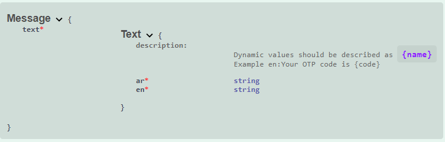
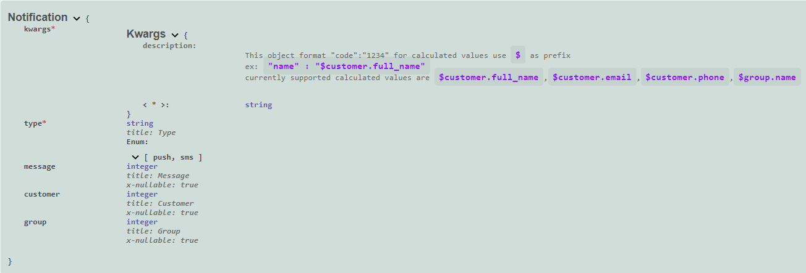
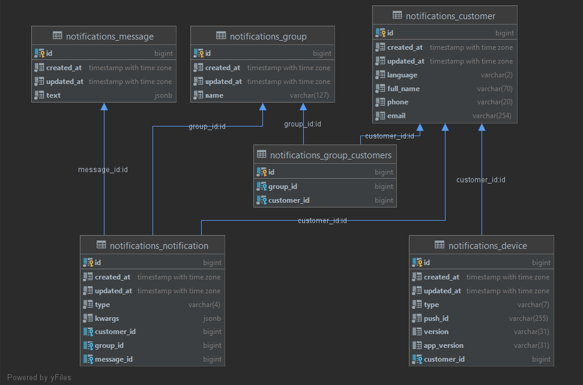
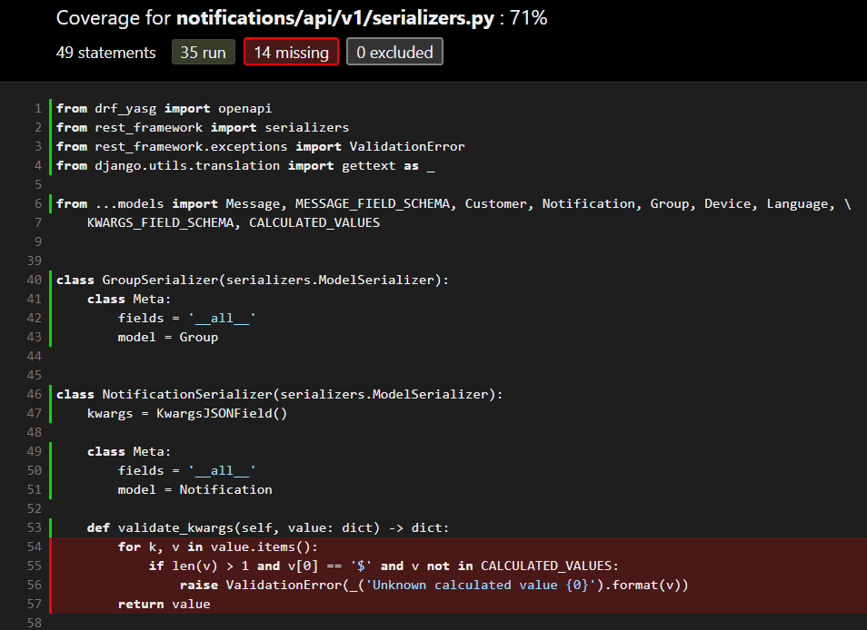

Notify
========

[](https://codecov.io/gh/shawara/Notify)

Notification service based on Django framework


Features
--------

* Dynamic templates to auto-populate notifications with real data

* Multiple languages (currently Arabic and English)

* Supports SMS and push notification

* Group notifications for marketing campaigns

* Ready to integrate with any SMS or Push notification provider


Technologies Used
-----------------

* Django3.2 — Python Web framework

* Celery — Distributed Task Queue

* Redis as a message broker and backend for results

* Docker & docker-compose for containerization
  
* Nginx

* Swagger — UI for API documentation

* Postgres database

* Flower —  web based tool for monitoring and administrating Celery clusters

* unittest — Unit testing framework


Installation
------------

Start

    docker-compose up --build
    # or
    make start

Create super user

    make superuser

Monitoring
----------

Django Admin => http://localhost/admin/

Flower => http://localhost:5555/ to see a beautiful presentation of running tasks, queues and workers


API Documentation
-----------------

1. Swagger => http://localhost/swagger/
2. Redoc => http://localhost/redoc/

### How to use it

1. Create message template : POST /api/v1/messages/
   
    ```json
    {
      "text": {
        "ar": "اهلا {name} كود التفعيل الخاص بك هو {code}",
        "en": "Hello {name} your OTP code is {code}"
      }
    }
    ```

2. Create notification : POST /api/v1/notifications/
    
    ```json
    {
      "kwargs": {
        "code": "7529",
        "name": "$customer.full_name"
      },
      "type": "push",
      "message": 2,
      "customer": 1,
      "group": null
    }
    ```

3. On Notification created signal will trigger sending the notification by workers

4. How cool is that!
    ```python
    # after populating kwargs calculated values ex: $customer.full_name
    str_msg = notification.message.text[notification.customer.language].format(**notification.kwargs)
    ```
Database Schema
---------------




Testing
-------
To run all test suite, run this command::

    make test

To see code coverage
    
    make cov
will generate beautiful html pages in `htmlcov` folder

